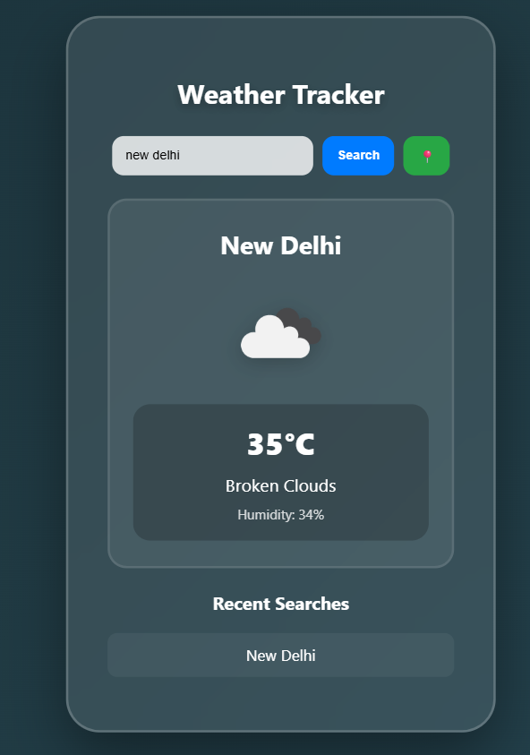

# 🌦️ Weather Tracker



A modern weather intelligence application built using **HTML5, CSS3, JavaScript (ES6+), OpenWeatherMap API, and Local Storage**.

Weather Tracker provides real-time weather information, location-based forecasts, persistent search history, offline awareness, and a modern glassmorphism interface designed to deliver a smooth and responsive user experience.

---

## 🚀 Live Demo & Repository

### 🌐 Live Application

https://divyaprasoon-weather-tracker.vercel.app/

### 📂 GitHub Repository

https://github.com/prasoon-develop/weather-tracker

---

## 📌 Project Overview

Weather Tracker is a real-time weather monitoring web application that allows users to search weather conditions for cities worldwide or automatically retrieve weather information based on their current location.

The application integrates external APIs, browser geolocation services, local storage persistence, and performance optimization techniques to provide a reliable and user-friendly experience.

Designed with a modern dashboard-style interface and glassmorphism effects, the project focuses on both functionality and visual appeal while maintaining clean code practices and responsive design principles.

---

## ✨ Core Features

### 🌍 Real-Time Weather Monitoring

- City-Based Weather Search
- Current Temperature Display
- Weather Condition Description
- Humidity Monitoring
- Dynamic Weather Icons
- Real-Time Data Retrieval

### 📍 Geolocation Support

- Automatic Location Detection
- Browser Geolocation API Integration
- Instant Local Weather Updates
- User Permission Handling

### 🔍 Smart Search Experience

- Persistent Search History
- Local Storage Integration
- Quick Access to Recent Searches
- Improved User Convenience

### ⚡ Performance Optimization

- Debounced Search Requests
- Reduced API Calls
- Efficient Data Fetching
- Improved Application Responsiveness

### 🌐 Connectivity Awareness

- Online Status Detection
- Offline Status Detection
- Real-Time Network Monitoring
- User Notification Banner

### 🎨 Modern User Interface

- Glassmorphism Design
- Dashboard-Inspired Layout
- Modern Card Components
- Responsive Design
- Mobile-Friendly Experience
- CSS Animations

---

## 🏗️ Project Architecture

```bash
weather-tracker/
│
├── index.html
├── style.css
├── script.js
└── assets/
    └── weather-tracker-preview.png
```

---

## 🔥 Technology Stack

| Layer           | Technology                                             |
| --------------- | ------------------------------------------------------ |
| Frontend        | HTML5, CSS3, JavaScript (ES6+)                         |
| API Integration | OpenWeatherMap API                                     |
| Browser APIs    | Geolocation API, Local Storage API, Network Status API |
| Networking      | Fetch API                                              |
| Deployment      | GitHub, Vercel                                         |

---

## ⚙️ Engineering Highlights

### API Integration

Integrated the OpenWeatherMap API to fetch accurate and real-time weather information for cities across the globe.

### Geolocation Services

Implemented browser geolocation functionality to automatically detect user location and retrieve corresponding weather data.

### Local Storage Persistence

Stored search history using Local Storage to improve usability and provide quick access to previously searched locations.

### Performance Optimization

Implemented Debouncing techniques to prevent excessive API requests and improve application efficiency during user input.

### Offline Resilience

Utilized the Browser Network Status API to detect connectivity changes and notify users when the application goes offline.

### Dynamic UI Rendering

Built a dynamic weather visualization interface using DOM manipulation techniques, enabling instant updates without page reloads.

### Modern Frontend Engineering

Applied responsive design principles, CSS animations, glassmorphism effects, and interactive UI rendering to create a polished user experience.

---

## 📊 Application Workflow

```text
User Search / Geolocation
            │
            ▼
     Weather Request
            │
            ▼
   Debounced API Call
            │
            ▼
 OpenWeatherMap API
            │
            ▼
  Weather Data Processing
            │
            ▼
 Dynamic UI Rendering
            │
            ▼
 Local Storage Update
```

---

## 🎯 Learning Outcomes

This project demonstrates practical experience with:

- REST API Integration
- Fetch API
- Asynchronous JavaScript
- Async/Await
- Browser Geolocation API
- Local Storage
- Network Status API
- Event Handling
- DOM Manipulation
- Debouncing Techniques
- Responsive Web Design
- CSS Animations
- Error Handling

---

## 📅 Project Timeline

**Project Type:** Portfolio Project

**Development Period:** October 2025 – November 2025

### Phase 1 — October 2025

- Project Architecture Design
- OpenWeatherMap API Integration
- Dynamic Weather Retrieval

### Phase 2 — November 2025

- Search History Persistence
- Glassmorphism UI Design
- Responsive Layout Improvements

### Phase 3 — November 2025

- Debouncing Implementation
- Offline Detection System
- Performance Optimization
- Enhanced User Experience

---

## 🚀 Future Enhancements

Planned improvements include:

- 7-Day Weather Forecast Support
- Air Quality Index Tracking
- Progressive Web App (PWA) Support
- Multiple City Comparison Dashboard
- Weather Alerts & Notifications
- Advanced Climate Insights

---

## 👨‍💻 Author

**Divya Prasoon**

B.E. Computer Science Engineering (Data Science)

Chandigarh University

---

## ⭐ Project Highlights

✔ Real-Time Weather Monitoring

✔ OpenWeatherMap API Integration

✔ Browser Geolocation Support

✔ Local Storage Persistence

✔ Debounced Search Optimization

✔ Offline Detection System

✔ Dynamic UI Rendering

✔ Glassmorphism User Interface

✔ Responsive Design

✔ Modern Frontend Engineering

✔ Portfolio-Ready Project

---

### Delivering Real-Time Weather Insights Through Modern Web Development 🌦️
